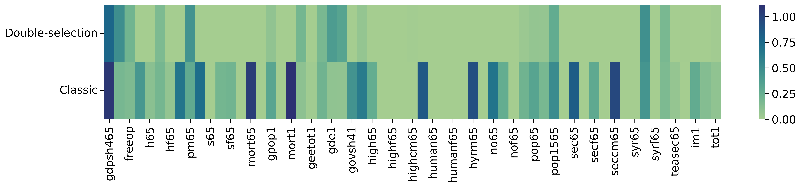

# Convergence Hypothesis Validation in the Solow-Swan-Ramsey Growth Model

## Project Overview

This project explores the validation of the convergence hypothesis within the framework of the Solow-Swan-Ramsey growth model, as initially proposed by [Cass (1965)](http://www.jstor.org/stable/2295827). Utilizing Bayesian methods, we offer a nuanced understanding of the dataset's relationships, focusing on the identification of relevant conditioning covariates. Our analysis not only uncovers overfitted scenarios before employing tests or credible sets but also achieves model sparsity—ensuring only the most significant factors are considered for enhanced interpretability and efficiency.

## Key Findings

- **Model Sparsity**: Achieved through careful selection of covariates, enhancing the model's interpretability and operational efficiency.

*Figure: Values of $\beta$ for the different approaches.*

- **Improved Accuracy**: A notable 45% increase in Mean Squared Error (MSE) performance, indicating more precise estimates.
- **Economic Insights**: Identification of trade openness and education as pivotal factors contributing to economic growth, underscoring the unique contributions of these covariates beyond classical analytical approaches.

## Methodology

The project employs Bayesian methods for data analysis, with a keen focus on achieving model sparsity and improving estimate accuracy. Cross-validation techniques alongside MSE comparisons were utilized to ensure the reliability and consistency of our results.
